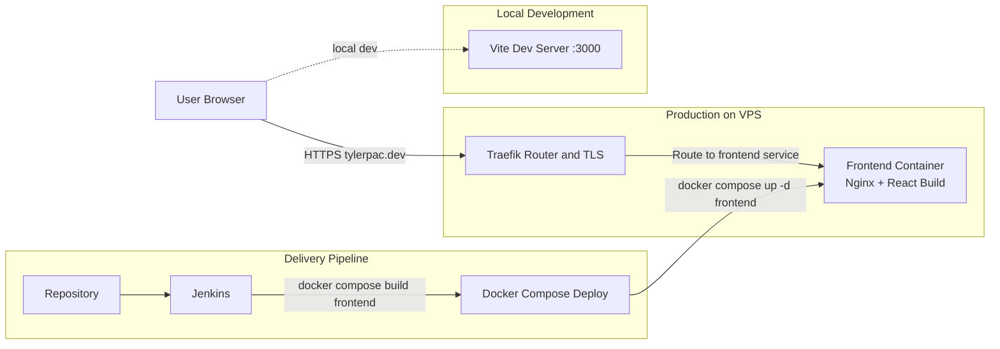
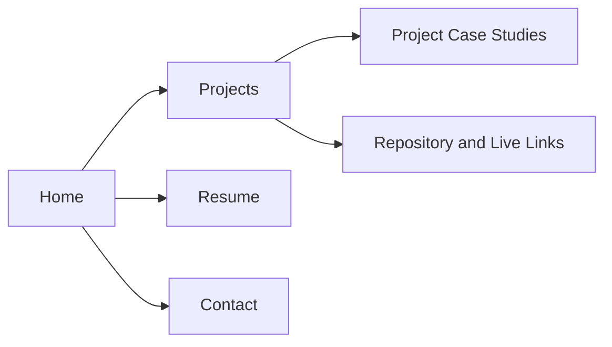

# TylerPac Development

Portfolio platform for projects, technical case studies, and professional engineering presence.

## About TylerPac Development

I built this site to keep everything about my engineering work in one place: project breakdowns, implementation details, resume access, and contact flow. It doubles as both a public portfolio and a practical example of how I design, ship, and operate frontend systems.

## Website

- [www.tylerpac.dev](https://www.tylerpac.dev)

## Features

- Project showcase pages with technical context and links
- Resume and career information in a dedicated public section
- Contact path for collaboration and engineering opportunities
- SPA routing for smooth navigation across portfolio sections
- Containerized deployment with reproducible runtime behavior
- CI/CD delivery through Jenkins and Docker Compose
- VPS production routing via Traefik with TLS

## Technology Stack

- **Frontend:** React + Vite
- **Routing:** React Router
- **Serving:** Nginx (inside frontend container)
- **Containerization:** Docker + Docker Compose
- **CI/CD:** Jenkins pipeline
- **Edge Routing:** Traefik (HTTPS + domain routing)

## Architecture

TylerPac Development is a frontend-first architecture. React/Vite powers the app, Nginx serves the built assets in a container, and Traefik handles secure domain routing in production.

### System Architecture

### Site Structure Diagram

## Contact

**Let's Connect**

For collaboration, engineering opportunities, or project discussions, use the contact page:

- [Contact TylerPac Development](https://www.tylerpac.dev/contact)
